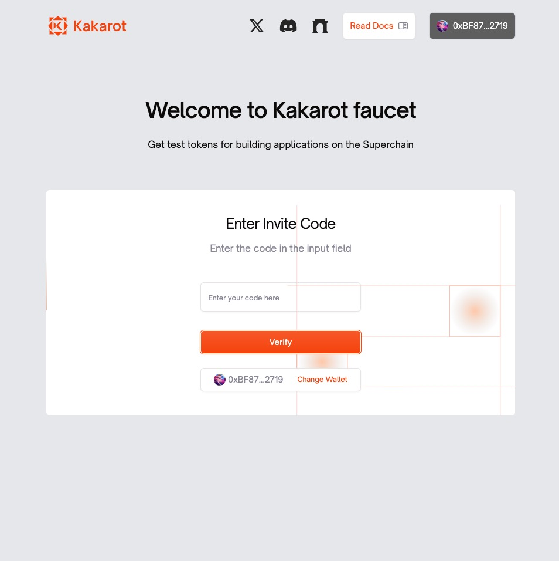

# Kakarot Faucet - Website

> The fast, native Sepolia Testnet faucet to kickstart your journey in the Kakarot ecosystem.

checkout the current deployment ✨ [faucet](https://faucet-staging.kakarot.org/) ✨

`faucet` gets you test tokens to build apps on the Kakarot Testnet!
<div align="center">
  
</div>

## 📂 project structure?

- `app/page.tsx` -> using next's app router, this is our home page
- `app/globals.css` -> base for tailwind + shared styles
- `components/` -> hosts all shared elements  + `/ui/` is base for `@shadcn` components
- `public/assets` -> all shared assets, `.svg` preffered
- `.env.example` -> create your own `.env` file following the structure here


## 🤓 what's the tech?

1. [`TailwindCSS`](https://tailwindcss.com)
2. [`TypeScript`](https://www.typescriptlang.org/)
3. [`NextJS`](https://nextjs.org/)
3. [`ReactQuery`](https://tanstack.com/query/latest)

## 🛠 want to install `faucet`, locally?

```bash
git clone https://github.com/kkrt-labs/faucet-frontend
cd faucet-frontend && npm i
npm run dev

# aleternatively, yarn && yarn dev -> installs packages + starts server at port 3000!
```

made at kkrt labs 🥕✌️
